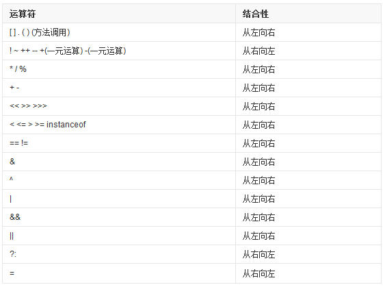
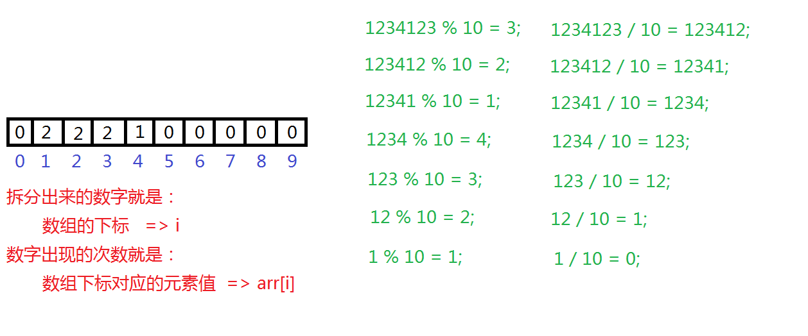
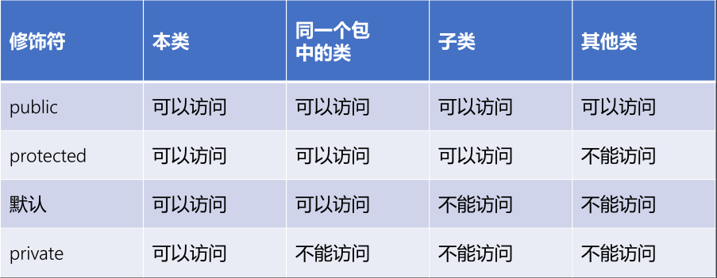
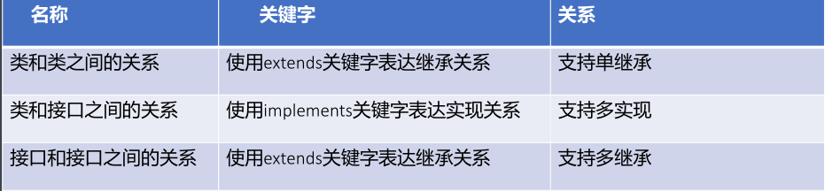

## 世界最好的语言JAVA

#### 目录

+ [Java基础](#Java基础)
  + [数据类型](#数据类型)
  + [进制的转换](#进制的转换)
  + [运算符](#运算符)
  + [分支流程](#分支流程)
  + [数组](#数组)
+ [类和对象](#类和对象)
  + [重载overload](#重载overload)
  + [构造块和静态代码块](#构造块和静态代码块)
  + [单例设计模式](#单例设计模式)
  + [继承extends](#继承extends)
  + [重写override](#重写override)
  + [访问控制符](#访问控制符)
  + [final](#final)
  + [多态](#多态)
  + [抽象类abstract](#抽象类abstract)
  + [接口interface](#接口interface)
  + [特殊类](#特殊类)
  + [注解](#注解)

##### IDEA快捷键

```txt
sout    System.out.println();
psvm  public static void main(String[] args) {}
alt+shift+上下方向键  可以移动代码
alt+shift+n  查找文件
alt+shift+r  全局搜索
```

### Java基础

#### 数据类型

##### 单个字节表示的整数范围( (重中之重) 

在计算机中单个字节表示八位二进制位，其中最高位(最左边)代表符号位，
使用0代表非负数，使用1代表负数，具体表示的整数范围如下：

+ 非负数表示范围：0000 0000 ~ 0111 1111 => 0 ~ 127 => 0 ~ 2^7-1
+ 负数表示范围：1000 0000 ~ 1111 1111 => -128 ~ -1 => -2^7 ~ -2^0
+  单个字节表示的整数范围是：-2^7 ~ 2^7-1，也就是-128 ~ 127.

```java
基本类型：
    byte short float int double boolean long char
```

##### 整数类型

 Java语言中描述整数数据的类型有：byte、short、int、long，荐int类型

+ 其中byte类型在内存空间中占1个字节，表示范围是：-2^7 ~ 2^7-1.
+ 其中short类型在内存空间中占2个字节，表示范围是：-2^15 ~ 2^15-1.
+ 其中int类型在内存空间中占4个字节，表示范围是：-2^31 ~ 2^31-1.
+ 其中long类型在内存空间中占8个字节，表示范围是：-2^63 ~ 2^63-1.
+ 在Java程序中直接写出的整数数据叫做直接量/字面值/常量，默认为int类
  型。若希望表达更大的直接量，则在直接量的后面加上l或者L，推荐L。

##### 浮点类型

 Java语言中用于描述小数数据的类型：float 和 double，推荐double类型

+ 其中float类型在内存空间占4个字节，叫做单精度浮点数，可以表示7位
  有效数字，范围：-3.403E38~3.403E38。(E38  10<sup>38</sup>)
+ 其中double类型在内存空间占8个字节，叫做双精度浮点数，可以表示15
  位有效数字，范围：-1.798E308~1.798E308。
+ Java程序中直接写出的小数数据叫做直接量，默认为double类型，若希望
  表达float类型的直接量，则需要在直接量的后面加上f或者F.

##### 字符类型

java语言中用于描述单个字符的数据类型：char类型。如：'a'、'中'等。其中char类型在内存空间中占2个字节并且没有符号位，表示的范围是：0 ~ 65535 

ASCII : 美国标准信息交换码
 要求掌握的ASCII有：'0' - 48 'A' - 65 'a' - 97 空格 - 32 换行符 - 10

Unicode：万国码 ， Java字符类型采用字符集编码。所有的字符都是16位。
 要求掌握的转义字符有：\" - " \' - ' \\ - \ \t - 制表符 \n - 换行符

#### 其他

Scanner 扫描器的输入输出

```java
/*
   编程实现变量的输入输出
 */
// 导入java目录中util目录的Scanner类
import java.util.Scanner; 
public class VarIOTest {
	public static void main(String[] args) {
		// 1.声明两个变量用于记录姓名和年龄信息
		//String name;
		//int age;
		
		// 2.提示用户从键盘输入姓名和年龄信息并放入到变量中   变量随使用随声明
		System.out.println("请输入您的姓名和年龄信息：");
		// 创建一个扫描器来扫描键盘输入的内容  System.in代表键盘输入
		Scanner sc = new Scanner(System.in);
		// 通过扫描器读取一个字符串数据放入变量name中
		String name = sc.next();
		// 通过扫描器读取一个整数数据放入变量age中
		int age = sc.nextInt();

		System.out.println("name = " + name + ", age = " + age);
	}
}
```

#### 进制的转换

 正十进制转换为二进制的方式
			a.除2取余法，使用十进制整数不断地除以2取出余数，直到商为0时将
余数逆序排序。
			b.拆分法，将十进制整数拆分为若干个二进制权重的和，有该权重下面
写1，否则写0。

​			45 => 2<sup>5</sup> + 2<sup>3</sup>  + 2<sup>2</sup>  + 2<sup>0</sup>  => 101101

负十进制转换为二进制的方式
			a.先将十进制的绝对值转换为二进制，然后进行按位取反再加1。

#### 运算符

##### 算数运算符

```java
// 3.注意事项
// 3.1 当两个整数相除时结果只保留整数部分，丢弃小数部分
System.out.println(5 / 2); // 2

// 3.2 若希望保留小数部分该如何处理？
// 处理方式一：使用强制类型转换将其中一个操作数转换为double类型再运算即可
System.out.println((double)5 / 2);   // 2.5
System.out.println(5 / (double)2);   // 2.5
System.out.println((double)5 / (double)2); // 2.5
System.out.println((double)(5 / 2)); // 2.0
// 处理方式二：让其中一个操作数乘以1.0即可（推荐）
System.out.println(5*1.0 / 2); // 2.5
System.out.println(5.0 / 2);   // 2.5   ia.0 错误的表示

// 3.3 0不能作除数
//System.out.println(5 / 0); // 编译ok，运行发生java.lang.ArithmeticException(算术异常 记住): / by zero
System.out.println(5 / 0.0); // Infinity 无穷
System.out.println(0 / 0.0); // NaN Not a Number
```

```java
/* 编程使用算术运算符实现秒数的拆分 */
import java.util.Scanner; 
public class ArithmeticTimeTest {
	public static void main(String[] args) {
		// 1.提示用户输入一个正整数的秒数并使用变量记录
		System.out.println("请输入一个正整数的秒数：");
		Scanner sc = new Scanner(System.in);
		int num = sc.nextInt();
		// 2.将正整数的秒数拆分为时分秒后并使用变量记录
		// 3666秒 => 1小时1分钟6秒钟
		// 3666 / 3600 = 1 小时    3666 % 3600 = 66 / 60 = 1 分钟   3666 % 60 = 6 秒钟 
		int hour = num / 3600;      // 拆分小时数
		int min = num % 3600 / 60;  // 拆分分钟数
		int sec = num % 60;         // 拆分秒数
		
		// 3.打印最终的拆分结果
		System.out.println(num + "秒转换为" + hour + "小时" +min+ "分钟" +sec+ "秒钟");

		// 4.+既可以作为字符串连接符，又可以作为加法运算符
		// 只要+两边的操作数中有一个操作数是字符串类型，则该+就被当做字符串连接符处理，否则当做加法运算符处理
		System.out.println(hour + min + sec);       // 8
		System.out.println(hour + min + sec + "");  // 8
		System.out.println(hour + min + "" + sec);  // 26
		System.out.println(hour + "" + min + sec);  // 116
		System.out.println("" + hour + min + sec);  // 116
		System.out.println("" + (hour + min + sec));// 8
	}
}
```

```java
// 自增自减
int ia=14
System.out.println(ia++ + ++ia);  // 30
System.out.println("ia = " + ia); // 16

// 复合赋值运算符的使用
int ia = 8;
//ia = ia + 2;  目前推荐使用该方式
ia += 2;        // 简化写法，从结果上来看是等价的
System.out.println("ia = " + ia); // ia = 10

byte b1 = 10;
System.out.println("b1 = " + b1); // b1 = 10
//b1 = b1 + 2; // 错误: 不兼容的类型: 从int转换到byte可能会有损失         byte + int 相加结果还是int类型
//b1 = b1 + (byte)2; // 错误: 不兼容的类型: 从int转换到byte可能会有损失   byte + byte 相加结果还是int类型  编译器优化
//b1 = (byte)(b1 + 2); // 强制类型转换，将int类型转换为byte
b1 += 2; // 真正等价于b1 = (byte)(b1 + 2);
System.out.println("b1 = " + b1); // b1 = 12
```

##### 关系运算符：

=  <  <=  !=  == 

##### 逻辑运算符: 

 && ||  ! 

逻辑运算符主要用于连接多个关系运算符作为最终运算的表达式，用于实现多条件的连接

```java
//测试一下短路特性
int ia = 3;
int ib = 5;
// 对于逻辑与运算符来说，若第一个条件为假则整个表达式为假，此时跳过第二个表达式不执行
boolean b4 = (++ia == 3) && (++ib == 5);
System.out.println("b4 = " + b4); // false
System.out.println("ia = " + ia); // 4
System.out.println("ib = " + ib); // 5

// 对于逻辑或运算符来说，若第一个条件为真则整个表达式为真，此时跳过第二个表达式不执行
boolean b5 = (++ia == 5) || (++ib == 5);
System.out.println("b5 = " + b5); // true
System.out.println("ia = " + ia); // 5
System.out.println("ib = " + ib); // 5
```

运算符优先级



#### 分支流程

```java
switch case：default; case 语句未break 结束 ，当前代码快和下一个case代码块都会执行，case穿透
    
for(;;){}
// 1.使用外层for循环控制打印的行数，一共9行
// 在()或{}中声明的变量叫做块变量，作用范围是从声明开始一直到语句块结束
outer:for(int i = 1; i <= 9; i++) {
    // 2.使用内层for循环控制打印的列数，最多9列，规律是：与当前行所在的行数相等
    for(int j = 1; j <= i; j++) {
        // 3.使用两个循环变量来拼接等式
        System.out.print(j + "*" + i + "=" + j*i + " ");
        // 4.当打印完毕6*6 = 36后结束整个打印
        if(6 == j) {
            //break; // 主要用于跳出循环，但该关键字只能跳出当前所在的循环
            break outer; // 表示可以跳出外层for循环
        }
    }
    System.out.println();
}

//continue语句用在循环体中，用于结束本次循环而开始下一次循环
//break用于退出当前语句块，break用在循环体中用于退出循环。
//for(;;) - 这种没有循环条件的循环叫做 无限循环，俗称“死循环”

while(){}
//while循环和for循环比较
    //• while循环和for循环完全可以互换，当然推荐使用for循环。
    //• while循环更适合于明确循环条件但不明确循环次数的场合中。
    //• for循环更适合于明确循环次数或范围的场合中。
    //• while(true) 等价于 for(;;) 都表示无限循环。
int i = 1;
while(i <= 10000);{  // 空语句，啥也不干，可以用于延时
    System.out.println("I Love You !");
    i++;
}

do{}while();
```

#### 数组

编程使用数组实现正整数中每个数字出现次数的统计 ，分析图：



```java
import java.util.Scanner; 
public class ArrayCountTest {
	public static void main(String[] args) {
		// 1.提示用户输入一个正整数并使用变量记录
		System.out.println("请输入一个正整数：");
		Scanner sc = new Scanner(System.in);
		int num = sc.nextInt();
		// 2.准备一个长度为10元素类型int类型的一维数组，默认值为0
		int[] arr = new int[10];
		// 3.拆分正整数中的每个数字并统计到一维数组中
		int temp = num;
		while(temp > 0) {
			arr[temp%10]++;
			temp /= 10;
		}
		// 4.打印最终的统计结果
		for(int i = 0; i < arr.length; i++) {
			if(arr[i] > 0) {
				System.out.println("数字" + i + "出现了" + arr[i] + "次！");
			}
		}
	}
}
```

### 类和对象

```txt
参数传递的注意事项
• 基本数据类型的变量作为方法的参数传递时，形参变量数值的改变通常不会影响到实参变量的数值，因为两个变量有各	自独立的内存空间；
• 引用数据类型的变量作为方法的参数传递时，形参变量指向内容的改变会影响到实参变量指向内容的数值，因为两个变	量指向同一块内存空间
• 当引用数据类型的变量作为方法的参数传递时，若形参变量改变指向后再改变指定的内容，则通常不会影响到实参变量	指向内容的改变，因为两个变量指向不同的内存空间。

内存结构之栈区
• 栈用于存放程序运行过程当中所有的局部变量。一个运行的Java程序从开始到结束会有多次方法的调用。
• JVM会为每一个方法的调用在栈中分配一个对应的空间，这个空间称为该方法的栈帧。一个栈帧对应一个正在调用中的	方法，栈帧中存储了该方法的参数、局部变量等数据。
• 当某一个方法调用完成后，其对应的栈帧将被清除。

传参的相关概念
• 参数分为形参和实参，定义方法时的参数叫形参，调用方法时传递的参数叫实参。
• 调用方法时采用值传递把实参传递给形参，方法内部其实是在使用形参。
• 所谓值传递就是当参数是基本类型时，传递参数的值，比如传递i=10，真实传参时，把10赋值给了形参。当参数是对	象时，传递的是对象的值，也就是把对象的地址赋值给形参
```

#### 重载overload

```txt
• 方法重载的主要形式体现在：参数的个数不同、参数的类型不同、参数的顺序不同，与返回值类型和形参变量名无关，	但建议返回值类型最好相同。
• 判断方法能否构成重载的核心：调用方法时能否加以区分。
```

#### 构造块和静态代码块

```java
/*
    编程实现构造块和静态代码块的使用
 */
public class BlockTest {
	// 当需要在执行构造方法体之前做一些准备工作时，则将准备工作的相关代码写在构造块中即可，比如：对成员变量进行的统一初始化操作
	{
		System.out.println("构造块！"); // (2)
	}
	// 静态代码块会随着类的加载而准备就绪，会先于构造块执行
	// 当需要在执行代码块之前随着类的加载做一些准备工作时，则编写代码到静态代码块中，比如：加载数据库的驱动包等
	static {
		System.out.println("#####################静态代码块！");   // (1)
	}
	// 自定义构造方法
	public BlockTest() {
		System.out.println("====构造方法体！"); // (3)
	}
	public static void main(String[] args) {
		BlockTest bt = new BlockTest();
		BlockTest bt2 = new BlockTest();
	}
}
```

#### 单例设计模式

```java
public class Singleton {
	// 2.声明本类类型的引用指向本类类型的对象，使用private static关键字共同修饰
	//private static Singleton sin = new Singleton();  // 饿汉式(推荐)
	private static Singleton sin = null;               // 懒汉式
	// 1.私有化构造方法，使用private关键字修饰
	private Singleton() {}
	// 3.提供公有的get方法负责将对象返回出去，使用public static关键字共同修饰
	public static Singleton getInstance() {
		//return sin;
		if(null == sin) {
			sin = new Singleton();
		}
		return sin;
	}
}
```

#### 继承extends

```txt
• 子类不能继承父类的构造方法和私有方法，但私有成员变量可以被继承只是不能直接访问。
• 无论使用何种方式构造子类的对象时都会自动调用父类的无参构造方法，来初始化从父类中继承的成员变量，相当于在	构造方法的第一行增加代码super()的效果
• 提高了代码的复用性，可维护性及扩展性，是多态的前提条件。
• 使用继承必须满足逻辑关系：子类 is a 父类，也就是不能滥用继承。
• Java语言中只支持单继承不支持多继承，也就是说一个子类只能有一个父类，但一个父类可以有多个子类。
```

#### 重写override

```txt
• 要求方法名相同、参数列表相同以及返回值类型相同，从Java5开始允许返回子类类型。
• 要求方法的访问权限不能变小，可以相同或者变大。
• 要求方法不能抛出更大的异常(异常机制)。
```

#### 访问控制符



#### final

```txt
final关键字修饰类体现在该类不能被继承。

• 主要用于防止滥用继承，如：java.lang.String类等。final关键字修饰成员方法体现在该方法不能被重写但可以	被继承。
• 主要用于防止不经意间造成重写，如：java.text.Dateformat类中format方法等。final关键字修饰成员变量体	现在该变量必须初始化且不能改变。
• 主要用于防止不经意间造成改变，如：java.lang.Thread类中MAX_PRIORITY等。
```

#### 多态

```txt
父类类型 引用变量名 = new 子类类型();
• 当父类类型的引用指向子类类型的对象时，父类类型的引用可以直接调用父类独有的方法。
• 当父类类型的引用指向子类类型的对象时，父类类型的引用不可以直接调用子类独有的方法。
• 对于父子类都有的非静态方法来说，编译阶段调用父类版本，运行阶段调用子类重写的版本（动态绑定）。
• 对于父子类都有的静态方法来说，编译和运行阶段都调用父类版本。

意义：多态的实际意义在于屏蔽不同子类的差异性实现通用的编程带来不同的
效果。
```

强制转换：

```java
// 在强制类型转换之前应该使用instanceof进行类型的判断
// 判断sr指向堆区内存中的对象是否为Circle类型，若是则返回true，否则返回false 
if(sr instanceof Circle) {
     System.out.println("可以放心地转换了！");
     Circle c1 = (Circle)sr;
 } else {
     System.out.println("强转有风险，操作需谨慎！");
 }
```

#### 抽象类abstract

抽象方法：

```java
//抽象方法主要指不能具体实现的方法并且使用abstract关键字修饰，也就是没有方法体。
//格式：  访问权限 abstract 返回值类型 方法名(形参列表);
public abstract void cry();
```

```tex
抽象类的概念
• 抽象类主要指不能具体实例化的类并且使用abstract关键字修饰，也就是
  不能创建对象。

抽象类和抽象方法的关系
• 抽象类中可以有成员变量、构造方法、成员方法；
• 抽象类中可以没有抽象方法，也可以有抽象方法；
• 拥有抽象方法的类必须是抽象类，因此真正意义上的抽象类应该是具有抽象方法并且使用abstract关键字修饰的类。

抽象类的实际意义
• 抽象类的实际意义不在于创建对象而在于被继承。
• 当一个类继承抽象类后必须重写抽象方法，否则该类也变成抽象类，也就是抽象类对子类具有强制性和规范性，因此叫做模板设计模式。
```

笔试考点

```java
public abstract double getLixi();
// private 和 abstract 关键字不能共同修饰一个方法
//private abstract double getLixi();
// 分析： private修饰的私有方法不能被继承，与abstract修饰的抽象方法必须被子类重写冲突

// final 和 abstract 关键字不能共同修饰一个方法
//public final abstract double getLixi();
// 分析：final修饰的方法只能继承不能重写

// static 和 abstract 关键字不能共同修饰一个方法
//public static abstract double getLixi();
// 分析：static修饰的方法可以类名.调用，与抽象方法不能被调用冲突
```

#### 接口interface

接口就是一种比抽象类还抽象的类，所有方法都为抽象方法，只能有常量

```java
public interface InterfaceTest {
    /*public static final */int CNT = 1;  // 里面只能有常量
    //private void show(){}  // 从Java9开始允许接口中出现私有方法
    /*public abstract */void show();         // 里面只能有抽象方法（新特性除外），注释中的关键字可以省略，但建议写上
}

// 类实现implements
```

类和接口之间的关系



抽象类和接口的主要区别

```tex
• 定义抽象类的关键字是abstract class，而定义接口的关键字是interface。
• 继承抽象类的关键字是extends，而实现接口的关键字是implements。
• 继承抽象类支持单继承，而实现接口支持多实现。
• 抽象类中可以有构造方法，而接口中不可以有构造方法。
• 抽象类中可以有成员变量，而接口中只可以有常量。

• 抽象类中可以有成员方法，而接口中只可以有抽象方法。
• 抽象类中增加方法时子类可以不用重写，而接口中增加方法时实现类需要重写（Java8以前的版本）。
• 从Java8开始增加新特性，接口中允许出现非抽象方法和静态方法，但非抽象方法需要使用default关键字修饰。
• 从Java9开始增加新特性，接口中允许出现私有方法。
```

```java
//Java8
// 增加非抽象方法
public default void show1() {
    show();
    System.out.println("show1方法中：这里仅仅是接口中的默认功能，实现类可以自由选择是否重写！");
}
 // 增加静态方法 隶属于类层级，也就是接口层级  接口名.调用
public static void test() {
    System.out.println("这里是静态方法，可以直接通过接口名.的方式调用，省略对象的创建");
}

//Java9
 // 将两个默认方法中重复的代码可以提取出来打包成一个方法在下面的两个方法中分别调用即可
private void show() {
    System.out.println("在以后的开发中尽量减少重复的代码，也就是减少代码的冗余！");
}
```

#### 特殊类

##### 内部类


##### 枚举enum

#### 注解

```java
//@Retention(RetentionPolicy.SOURCE)     // 表示下面的注解在源代码中有效
//@Retention(RetentionPolicy.CLASS)      // 表示下面的注解在字节码文件中有效，默认方式
@Retention(RetentionPolicy.RUNTIME)      // 表示下面的注解在运行时有效
@Documented                              // 表示下面的注解信息可以被javadoc工具提取到API文档中，很少使用
// 表示下面的注解可以用于类型、构造方法、成员变量、成员方法、参数 的修饰
@Target({ElementType.TYPE, ElementType.CONSTRUCTOR, ElementType.FIELD, ElementType.METHOD, ElementType.PARAMETER})
@Inherited  // 表示下面的注解所修饰的类中的注解使用可以被子类继承
// 若一个注解中没有任何的成员，则这样的注解叫做标记注解/标识注解
public @interface MyAnnotation {
    //public Direction value(); // 声明一个String类型的成员变量，名字为value   类型有要求
    public String value() default "123"; // 声明一个String类型的成员变量，名字为value
    public String value2();
}
```

### 核心类


