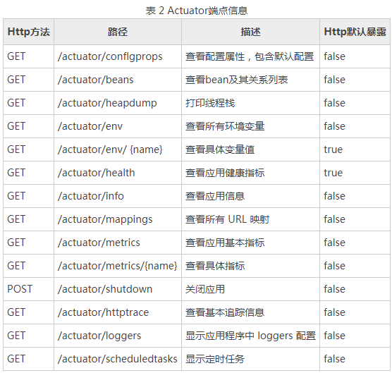

## MySpringBootlearning


### 读取配置文件

1.Environment

```java
 // 注入对象
@Autowired
private Environment env;
@GetMapping("/hello")
public String hello() {
    // 读取配置
    String port = env.getProperty("server.port");
    return port;
}
```

2.@Value

```java
 // 注入配置
@Value("${server.port}")
private String port;
```

3.自定义配置类

```java
@ConfigurationProperties(prefix = "com.zp")
@Component
@Data
public class MyConfig {
    private String name;
    private Integer age;
}
```

定义配置 application.properties 的方法如下：

```properties
com.zp.name=zhengpeng
com.zp.age=18
```

### profiles 多环境配置

在 Spring Boot 中可以通过 spring.profiles.active=dev 来激活不同环境下的配置

### actuator 监控

Spring Boot 提供了一个用于监控和管理自身应用信息的模块，它就是 spring-boot-starter-actuator,添加依赖即可。

```xml
<dependency>
    <groupId>org.springframework.boot</groupId>
    <artifactId>spring-boot-starter-actuator</artifactId>
</dependency>
```





```properties
#显示一些健康信息的详情
management.endpoint.health.show-details=ALWAYS
#配置需要暴露的端点
management.endpoints.web.exposure.include=configprops,beans
#management.endpoints.web.exposure.include=*
```

#### 自定义 actuator 端点

参考http://c.biancheng.net/view/5316.html