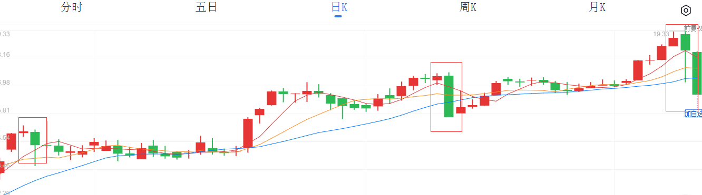
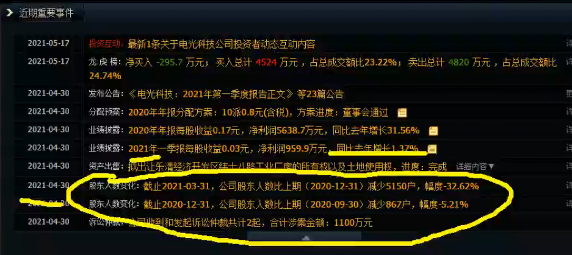
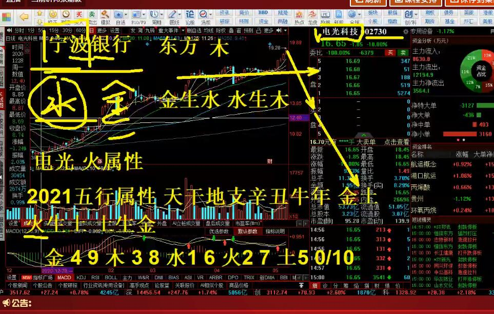

## 炒股随记

#### 股市术语

**北向资金**：“北”指的是沪深两市的股票，“南”指的是指香港股票，北上资金就是指从香港股票中流入大陆股市的资金。同时内地的股票流入香港股市的资金，称为**南下资金**

**内盘**常用S表示，**外盘**用B表示

**内盘**：在成交量中以主动性叫卖价格成交的数量，所谓主动性叫卖，即是在实盘买卖中，卖方主动以低于或等于当前买一的价格挂单卖出股票时成交的数量，显示空方的总体实力。

**外盘**：在成交量中以主动性叫买价格成交的数量，所谓主动性叫买，即是在实盘买卖中，买方主动以高于或等于当前卖一的价格挂单买入股票时成交的数量，显示多方的总体实力

2021.5.16 

加人精忠社，社长：杨忠国，会员账号：060504，密码：518518

外援：张嘉毅（松山资本）<五行股术>  ， 高远山（橡树资本）

会议内容：

A股走势（行情稳，风险少）---->北向资金流入（国外投资机构，注重价值投资）---->疯牛行情（结构牛基础）

2019--至今大变革

开创科创版，提出证券交易新规，修改创业版交易规则，新基发布增多，核心目的：去散户化，大力发展基金企业

散户前状：价值投资是笑话，投机才是永恒，目前变化:跟随专业人员机构，新的开始，确立投资方向

精忠社终极目的：传授资本知识，规划投资方向，享受中国实现全面社会主义时代的资本红利

### 精忠擒牛计划

##### 第一阶段：目标收益180%

2021.5.17 第一枪

前期走势分析:以跌停拉升股价

电光科技（002730），9：30以18.425买入（200股） ，开盘十分钟，9.35之后直接打到跌停，庄家洗盘，等待下一次拉升，16.65最低价格买入点，接下来的起涨点。

5分钟直接跌停，场外资金不敢买入，庄家如果想出货和卖票，肯定是想场外资金买入，多多益善，股价稳定，小幅拉伸，才能喜迎场外资金买入，现在五分钟砸跌停，所以庄家是不想出货卖票。股价拉升，即使涨停，也会有场外资金买入追涨，防止买入主力筹码过多，因此直接砸跌停。

**尾盘盈亏-15%**

2021.05.18  

**电光科技（002730）**，因叶飞事件（与机构分账不均）开盘跌停。盈亏-20%

未来拉升空间很大，分析如下：

1.走势大体不受A股大盘所影响

2.庄家经常用砸盘跌停洗盘手法，后续持续拉升

3.公司股东人数持续减少，股权比例集中化

4.张嘉毅老师的五行股术

**尾盘:盈亏-20%**

2021.5.19

电光科技（002730）持续跌停，开盘跌停 三连

分析：先向下方回踩下方支撑3490-3500点，大盘小幅度下跌，1-3个交易日的主旋律，弹簧效应，压缩力度越大，反弹越孟。

四个操作：

1.买进要有理由 

2.买进设置止损点，短线10个点，超短线5个点，中线20个点

3.设置止盈空间 短线10个点左右3-5%

扭亏为盈计划：A+B股：A个股（电光科技（002730））亏损情况下，暂冷处理，选择绩优股B个股来中长线进行回血，等待A个股有回升情况再进行抄底扭亏。

**尾盘:盈亏-24%**

2021.5.20

电光科技（002730）再次开盘跌停

B个股 ：爱尔眼科（300015 创）

​				通策医疗 (600763)

**尾盘:盈亏-30.71%**

2021.5.21

电光科技（002730）开盘有所回升

10：30补仓一手

